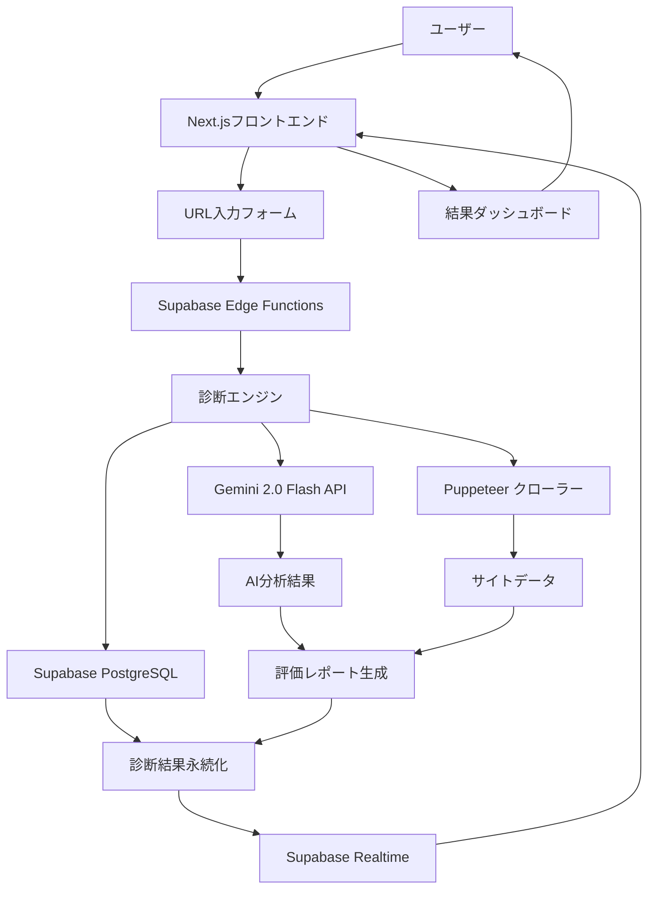
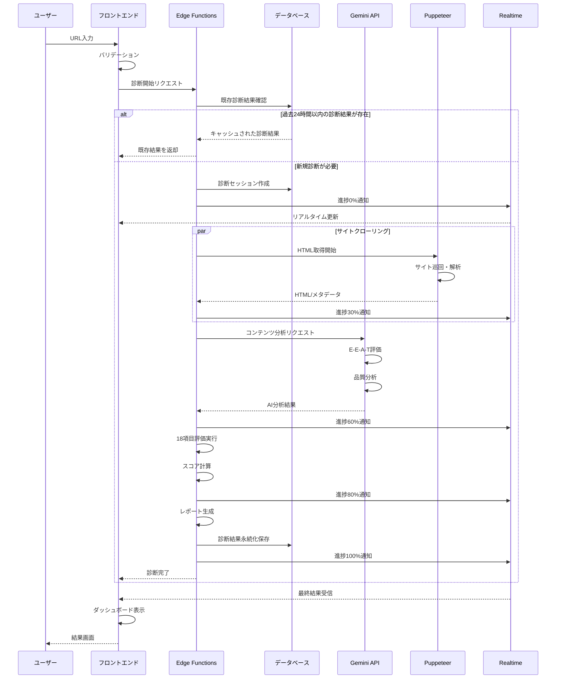
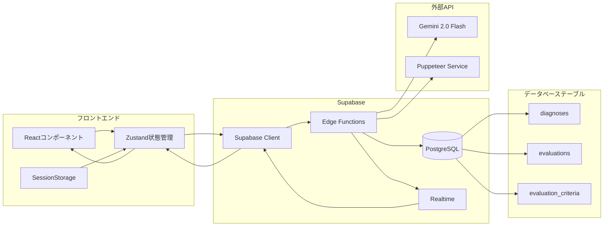
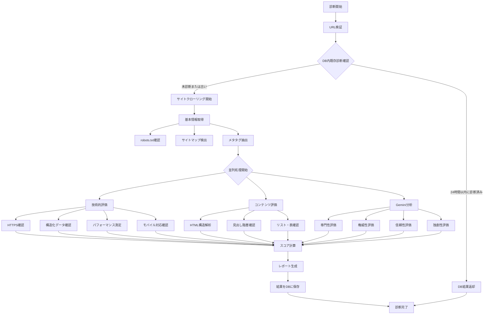
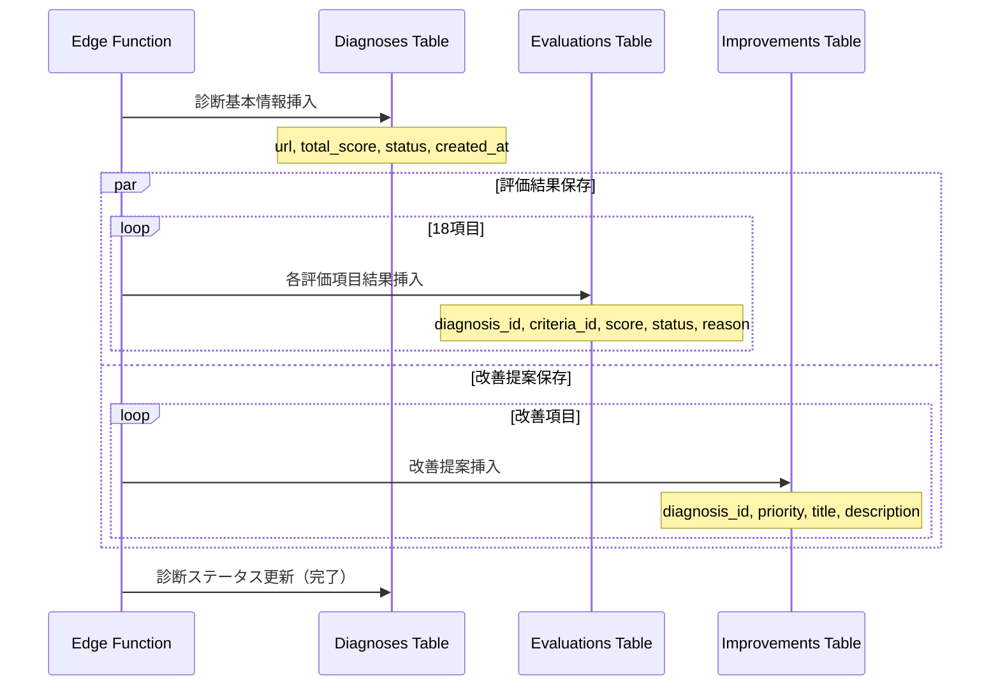
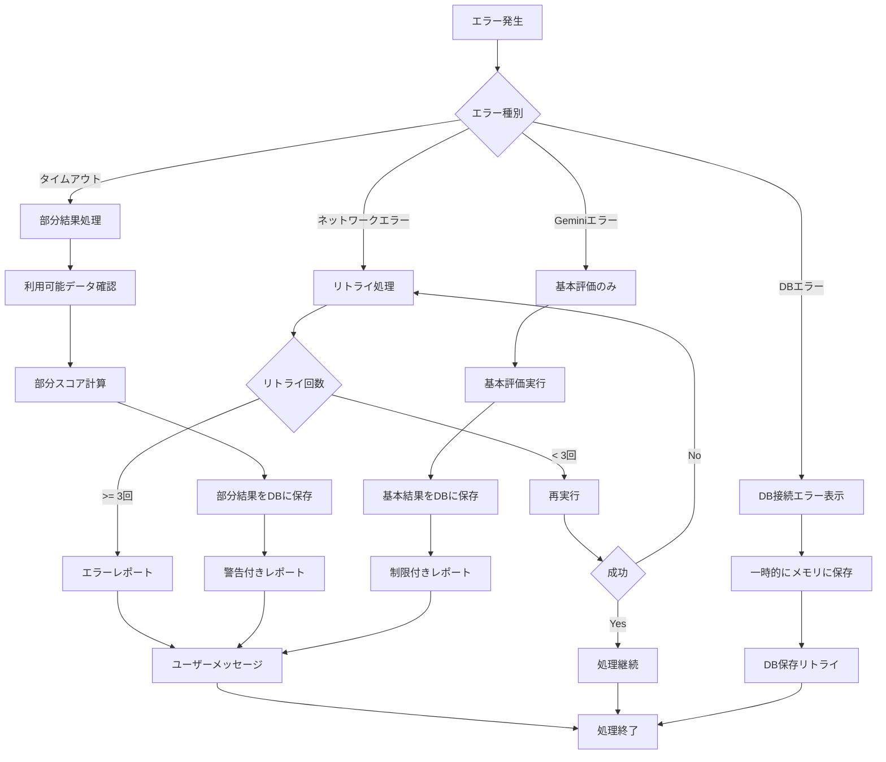
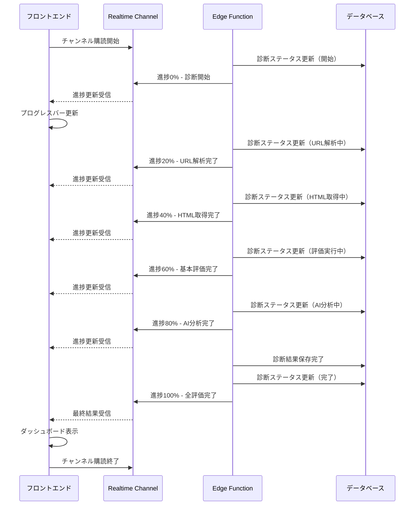
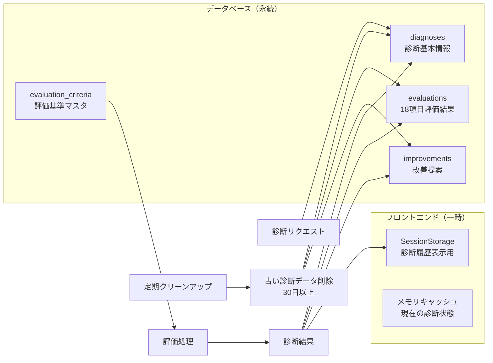
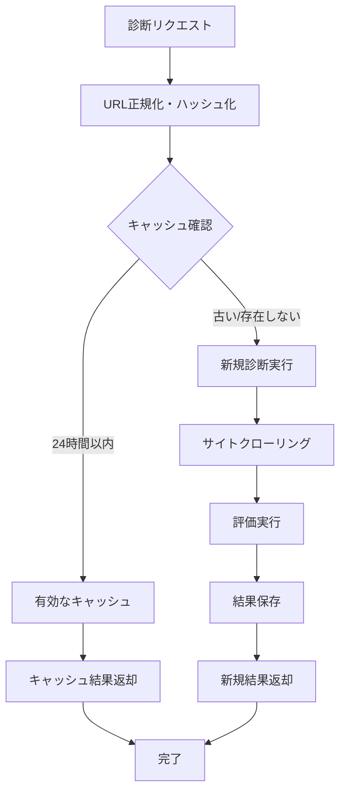

# LLMO無料診断 データフロー図

## ユーザーインタラクションフロー

```mermaid
flowchart TD
    A[ユーザー] --> B[Next.jsフロントエンド]
    B --> C[URL入力フォーム]
    C --> D[Supabase Edge Functions]
    D --> E[診断エンジン]
    E --> F[Gemini 2.0 Flash API]
    E --> G[Puppeteer クローラー]
    E --> H[Supabase PostgreSQL]
    H --> I[診断結果永続化]
    F --> J[AI分析結果]
    G --> K[サイトデータ]
    J --> L[評価レポート生成]
    K --> L
    L --> I
    I --> M[Supabase Realtime]
    M --> B
    B --> N[結果ダッシュボード]
    N --> A
```

## 詳細データ処理フロー

```mermaid
sequenceDiagram
    participant U as ユーザー
    participant F as フロントエンド
    participant E as Edge Functions
    participant D as データベース
    participant G as Gemini API
    participant P as Puppeteer
    participant R as Realtime
    
    U->>F: URL入力
    F->>F: バリデーション
    F->>E: 診断開始リクエスト
    
    E->>D: 既存診断結果確認
    alt 過去24時間以内の診断結果が存在
        D-->>E: キャッシュされた診断結果
        E-->>F: 既存結果を返却
    else 新規診断が必要
        E->>D: 診断セッション作成
        E->>R: 進捗0%通知
        R-->>F: リアルタイム更新
        
        par サイトクローリング
            E->>P: HTML取得開始
            P->>P: サイト巡回・解析
            P-->>E: HTML/メタデータ
            E->>R: 進捗30%通知
        end
        
        E->>G: コンテンツ分析リクエスト
        G->>G: E-E-A-T評価
        G->>G: 品質分析
        G-->>E: AI分析結果
        E->>R: 進捗60%通知
        
        E->>E: 18項目評価実行
        E->>E: スコア計算
        E->>R: 進捗80%通知
        
        E->>E: レポート生成
        E->>D: 診断結果永続化保存
        E->>R: 進捗100%通知
        E-->>F: 診断完了
    end
    
    R-->>F: 最終結果受信
    F->>F: ダッシュボード表示
    F-->>U: 結果画面
```

## システム間データフロー

```mermaid
graph LR
    subgraph "フロントエンド"
        UI[Reactコンポーネント]
        STATE[Zustand状態管理]
        SESSION[SessionStorage]
    end
    
    subgraph "Supabase"
        API[Supabase Client]
        EF[Edge Functions]
        DB[(PostgreSQL)]
        RT[Realtime]
    end
    
    subgraph "外部API"
        GM[Gemini 2.0 Flash]
        PP[Puppeteer Service]
    end
    
    subgraph "データベーステーブル"
        DIAG[diagnoses]
        EVAL[evaluations]
        CRITERIA[evaluation_criteria]
    end
    
    UI --> STATE
    STATE --> API
    API --> EF
    EF --> DB
    DB --> DIAG
    DB --> EVAL
    DB --> CRITERIA
    EF --> GM
    EF --> PP
    EF --> RT
    RT --> API
    API --> STATE
    STATE --> UI
    SESSION --> STATE
```

## 評価処理の詳細フロー

```mermaid
flowchart TD
    START[診断開始] --> VALIDATE[URL検証]
    VALIDATE --> DB_CHECK{DB内既存診断確認}
    DB_CHECK -->|24時間以内に診断済み| RETURN_DB[DB結果返却]
    DB_CHECK -->|未診断または古い| CRAWL[サイトクローリング開始]
    
    CRAWL --> BASIC[基本情報取得]
    BASIC --> ROBOTS[robots.txt確認]
    BASIC --> SITEMAP[サイトマップ検出]
    BASIC --> META[メタタグ抽出]
    
    META --> PARALLEL{並列処理開始}
    
    PARALLEL --> TECHNICAL[技術的評価]
    PARALLEL --> CONTENT[コンテンツ評価]
    PARALLEL --> GEMINI[Gemini分析]
    
    TECHNICAL --> HTTPS[HTTPS確認]
    TECHNICAL --> SCHEMA[構造化データ確認]
    TECHNICAL --> PERF[パフォーマンス測定]
    TECHNICAL --> MOBILE[モバイル対応確認]
    
    CONTENT --> STRUCTURE[HTML構造解析]
    CONTENT --> HEADING[見出し階層確認]
    CONTENT --> LIST[リスト・表確認]
    
    GEMINI --> EXPERTISE[専門性評価]
    GEMINI --> AUTHORITY[権威性評価]
    GEMINI --> TRUST[信頼性評価]
    GEMINI --> ORIGINALITY[独創性評価]
    
    HTTPS --> SCORE_CALC[スコア計算]
    SCHEMA --> SCORE_CALC
    PERF --> SCORE_CALC
    MOBILE --> SCORE_CALC
    STRUCTURE --> SCORE_CALC
    HEADING --> SCORE_CALC
    LIST --> SCORE_CALC
    EXPERTISE --> SCORE_CALC
    AUTHORITY --> SCORE_CALC
    TRUST --> SCORE_CALC
    ORIGINALITY --> SCORE_CALC
    
    SCORE_CALC --> REPORT[レポート生成]
    REPORT --> SAVE_DB[結果をDBに保存]
    SAVE_DB --> END[診断完了]
    
    RETURN_DB --> END
```

## データベース保存フロー

```mermaid
sequenceDiagram
    participant E as Edge Function
    participant D as Diagnoses Table
    participant EV as Evaluations Table
    participant IM as Improvements Table
    
    E->>D: 診断基本情報挿入
    Note over D: url, total_score, status, created_at
    
    par 評価結果保存
        loop 18項目
            E->>EV: 各評価項目結果挿入
            Note over EV: diagnosis_id, criteria_id, score, status, reason
        end
    and 改善提案保存
        loop 改善項目
            E->>IM: 改善提案挿入
            Note over IM: diagnosis_id, priority, title, description
        end
    end
    
    E->>D: 診断ステータス更新（完了）
```

## エラーハンドリングフロー

```mermaid
flowchart TD
    ERROR[エラー発生] --> TYPE{エラー種別}
    
    TYPE -->|ネットワークエラー| RETRY[リトライ処理]
    TYPE -->|タイムアウト| PARTIAL[部分結果処理]
    TYPE -->|DBエラー| DB_ERROR[DB接続エラー表示]
    TYPE -->|Geminiエラー| FALLBACK[基本評価のみ]
    
    RETRY --> COUNT{リトライ回数}
    COUNT -->|< 3回| RETRY_EXEC[再実行]
    COUNT -->|>= 3回| ERROR_REPORT[エラーレポート]
    
    RETRY_EXEC --> SUCCESS{成功}
    SUCCESS -->|Yes| CONTINUE[処理継続]
    SUCCESS -->|No| RETRY
    
    PARTIAL --> AVAILABLE[利用可能データ確認]
    AVAILABLE --> PARTIAL_SCORE[部分スコア計算]
    PARTIAL_SCORE --> PARTIAL_SAVE[部分結果をDBに保存]
    PARTIAL_SAVE --> WARNING[警告付きレポート]
    
    FALLBACK --> BASIC_EVAL[基本評価実行]
    BASIC_EVAL --> BASIC_SAVE[基本結果をDBに保存]
    BASIC_SAVE --> LIMITED_REPORT[制限付きレポート]
    
    DB_ERROR --> TEMP_STORAGE[一時的にメモリに保存]
    TEMP_STORAGE --> RETRY_SAVE[DB保存リトライ]
    
    ERROR_REPORT --> USER_MESSAGE[ユーザーメッセージ]
    WARNING --> USER_MESSAGE
    LIMITED_REPORT --> USER_MESSAGE
    
    USER_MESSAGE --> END[処理終了]
    CONTINUE --> END
    RETRY_SAVE --> END
```

## リアルタイム更新フロー

```mermaid
sequenceDiagram
    participant F as フロントエンド
    participant R as Realtime Channel
    participant E as Edge Function
    participant D as データベース
    
    F->>R: チャンネル購読開始
    E->>D: 診断ステータス更新（開始）
    E->>R: 進捗0% - 診断開始
    R-->>F: 進捗更新受信
    F->>F: プログレスバー更新
    
    E->>D: 診断ステータス更新（URL解析中）
    E->>R: 進捗20% - URL解析完了
    R-->>F: 進捗更新受信
    
    E->>D: 診断ステータス更新（HTML取得中）
    E->>R: 進捗40% - HTML取得完了
    R-->>F: 進捗更新受信
    
    E->>D: 診断ステータス更新（評価実行中）
    E->>R: 進捗60% - 基本評価完了
    R-->>F: 進捗更新受信
    
    E->>D: 診断ステータス更新（AI分析中）
    E->>R: 進捗80% - AI分析完了
    R-->>F: 進捗更新受信
    
    E->>D: 診断結果保存完了
    E->>D: 診断ステータス更新（完了）
    E->>R: 進捗100% - 全評価完了
    R-->>F: 最終結果受信
    F->>F: ダッシュボード表示
    
    F->>R: チャンネル購読終了
```

## データ永続化戦略

```mermaid
flowchart LR
    subgraph "フロントエンド（一時）"
        SESSION[SessionStorage<br>診断履歴表示用]
        MEMORY[メモリキャッシュ<br>現在の診断状態]
    end
    
    subgraph "データベース（永続）"
        DIAGNOSES[diagnoses<br>診断基本情報]
        EVALUATIONS[evaluations<br>18項目評価結果]
        IMPROVEMENTS[improvements<br>改善提案]
        CRITERIA[evaluation_criteria<br>評価基準マスタ]
    end
    
    INPUT[診断リクエスト] --> DIAGNOSES
    RESULT[診断結果] --> SESSION
    RESULT --> DIAGNOSES
    RESULT --> EVALUATIONS
    RESULT --> IMPROVEMENTS
    
    CRITERIA --> EVAL[評価処理]
    EVAL --> RESULT
    
    CLEANUP[定期クリーンアップ] --> OLD[古い診断データ削除<br>30日以上]
    OLD --> DIAGNOSES
    OLD --> EVALUATIONS
    OLD --> IMPROVEMENTS
```

## キャッシュ戦略

```mermaid
flowchart TD
    REQUEST[診断リクエスト] --> URL_HASH[URL正規化・ハッシュ化]
    URL_HASH --> CACHE_CHECK{キャッシュ確認}
    
    CACHE_CHECK -->|24時間以内| VALID_CACHE[有効なキャッシュ]
    CACHE_CHECK -->|古い/存在しない| NEW_DIAGNOSIS[新規診断実行]
    
    VALID_CACHE --> RETURN_CACHED[キャッシュ結果返却]
    NEW_DIAGNOSIS --> CRAWL[サイトクローリング]
    CRAWL --> EVALUATE[評価実行]
    EVALUATE --> SAVE_RESULT[結果保存]
    SAVE_RESULT --> RETURN_NEW[新規結果返却]
    
    RETURN_CACHED --> END[完了]
    RETURN_NEW --> END
```