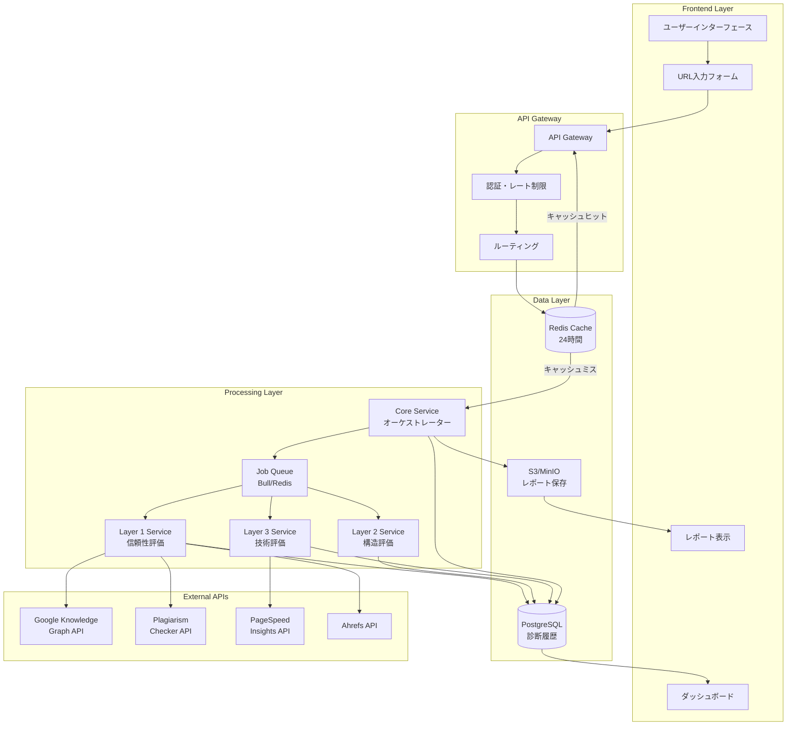
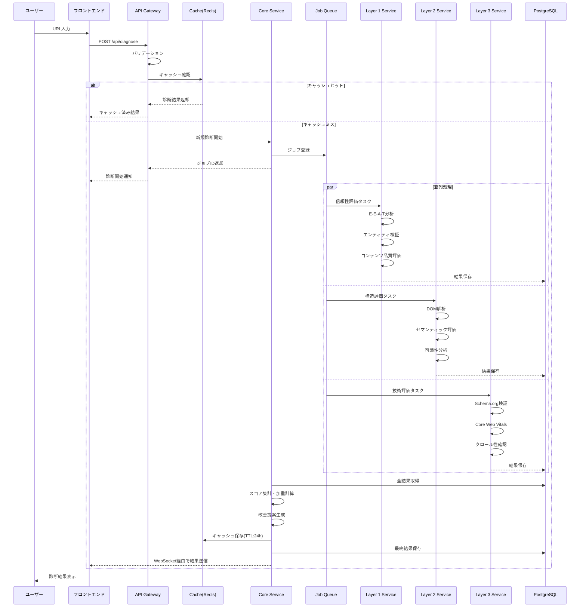
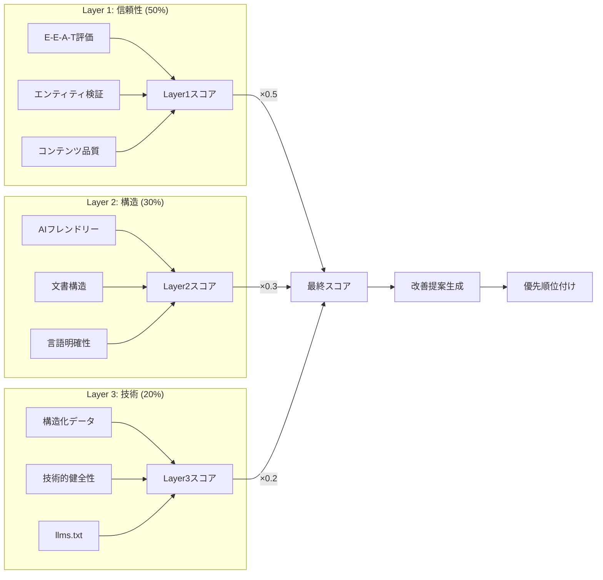
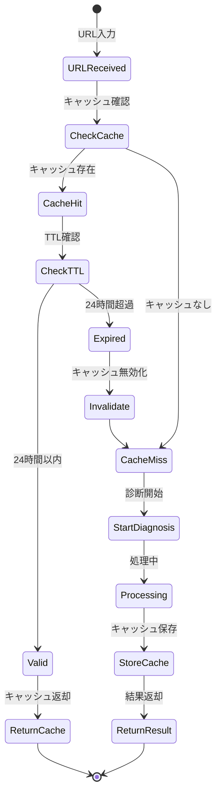
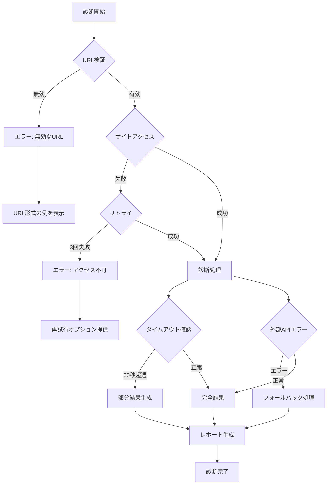
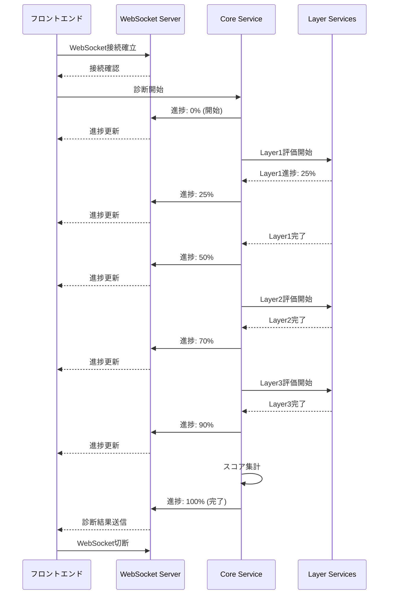
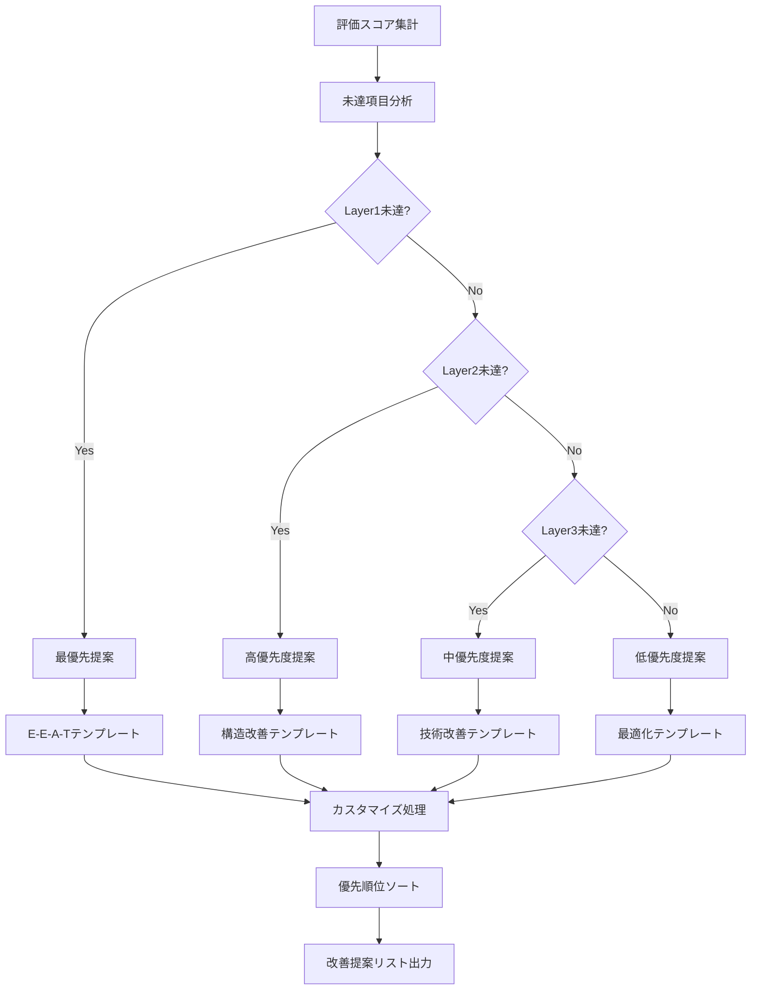

# LLMO診断ツール データフロー図

## 1. システム全体のデータフロー

## 2. URL診断処理フロー

## 3. 3層評価処理フロー

## 4. キャッシュ戦略フロー

## 5. エラー処理フロー

## 6. リアルタイム進捗通知フロー

## 7. 改善提案生成フロー

## データフローの特徴

### 並列処理
- 3層の評価を独立して並列実行
- 外部API呼び出しの非同期処理
- ジョブキューによる負荷分散

### キャッシュ戦略
- 24時間のTTLで診断結果をキャッシュ
- URL正規化によるキャッシュヒット率向上
- 段階的なキャッシュ無効化

### エラーハンドリング
- グレースフルデグラデーション
- 部分的な結果返却
- フォールバック処理

### リアルタイム性
- WebSocketによる進捗通知
- Server-Sent Events (SSE) のフォールバック
- 非同期処理の可視化