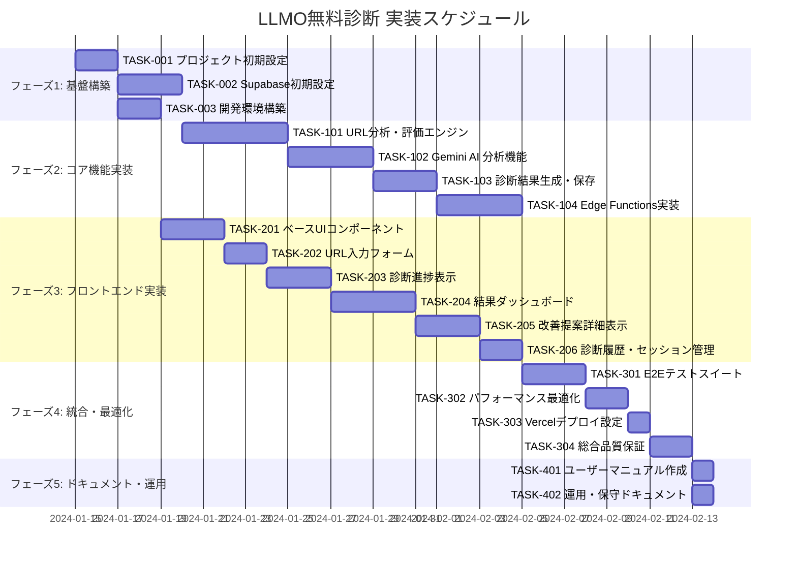

# LLMO無料診断 実装タスク

## 概要

**全タスク数**: 28タスク  
**推定作業時間**: 120-150時間  
**クリティカルパス**: TASK-001 → TASK-002 → TASK-101 → TASK-201 → TASK-301  

## タスク一覧

### フェーズ1: 基盤構築（推定: 30時間）

#### TASK-001: プロジェクト初期設定

- [x] **タスク完了**
- **タスクタイプ**: DIRECT
- **要件リンク**: アーキテクチャ全般
- **依存タスク**: なし
- **実装詳細**:
  - Next.js 14プロジェクトの初期化
  - TypeScript設定（tsconfig.json）
  - pnpmワークスペース設定
  - ESLint + Prettier + Biome設定
  - Tailwind CSS + shadcn/ui インストール
- **テスト要件**:
  - [ ] プロジェクトビルドテスト
  - [ ] リンター実行テスト
  - [ ] 型チェックテスト
- **完了条件**:
  - [ ] `npm run build` が成功する
  - [ ] `npm run lint` でエラーがない
  - [ ] `npm run type-check` が成功する

#### TASK-002: Supabase初期設定

- [x] **タスク完了**
- **タスクタイプ**: DIRECT
- **要件リンク**: REQ-007, データベース設計
- **依存タスク**: TASK-001
- **実装詳細**:
  - Supabaseプロジェクトの作成
  - PostgreSQLスキーマの適用
  - RLS ポリシーの設定
  - 評価基準マスタデータの投入
  - Edge Functions基本セットアップ
- **テスト要件**:
  - [ ] データベース接続テスト
  - [ ] テーブル作成確認
  - [ ] RLS動作確認
  - [ ] 初期データ投入確認
- **完了条件**:
  - [ ] 全テーブルが作成されている
  - [ ] 18項目の評価基準が投入されている
  - [ ] RLSが正常に動作している

#### TASK-003: 開発環境構築

- [x] **タスク完了**
- **タスクタイプ**: DIRECT  
- **要件リンク**: 技術スタック全般
- **依存タスク**: TASK-001, TASK-002
- **実装詳細**:
  - Docker Compose設定（開発用）
  - 環境変数テンプレート作成
  - Vitest + Playwright設定
  - GitHub Actions CI/CD設定
- **テスト要件**:
  - [ ] Docker環境起動テスト
  - [ ] テストランナー動作確認
  - [ ] CI/CDパイプライン動作確認
- **完了条件**:
  - [ ] ローカル開発環境が動作する
  - [ ] テストスイートが実行できる

### フェーズ2: コア機能実装（推定: 80時間）

#### TASK-101: URL分析・評価エンジン

- [ ] **タスク完了**
- **タスクタイプ**: TDD
- **要件リンク**: REQ-001, REQ-002
- **依存タスク**: TASK-002
- **実装詳細**:
  - URLバリデーション機能
  - Puppeteer を使ったクローリング
  - HTML解析・メタデータ抽出
  - 18項目の基本評価ロジック
  - 技術的シグナル検出
- **テスト要件**:
  - [ ] 単体テスト: URL正規化
  - [ ] 単体テスト: HTML解析ロジック
  - [ ] 統合テスト: クローリングフロー
  - [ ] エッジケーステスト: 無効URL処理
- **完了条件**:
  - [ ] 有効なURLが正しく解析される
  - [ ] 18項目の基本評価が実行される
  - [ ] robots.txt, サイトマップが検出される

#### TASK-102: Gemini AI 分析機能

- [ ] **タスク完了**
- **タスクタイプ**: TDD
- **要件リンク**: E-E-A-T評価、コンテンツ品質分析
- **依存タスク**: TASK-101
- **実装詳細**:
  - Gemini 2.0 Flash API連携
  - E-E-A-T評価プロンプト設計
  - コンテンツ品質分析
  - 改善提案生成ロジック
  - API失敗時のフォールバック処理
- **テスト要件**:
  - [ ] 単体テスト: プロンプト生成
  - [ ] 統合テスト: Gemini API呼び出し
  - [ ] モックテスト: API失敗時の処理
- **エラーハンドリング**:
  - [ ] API レート制限
  - [ ] タイムアウト処理
  - [ ] 基本評価への降格処理
- **完了条件**:
  - [ ] E-E-A-T分析が実行される
  - [ ] 具体的な改善提案が生成される
  - [ ] API失敗時も部分結果を返す

#### TASK-103: 診断結果生成・保存

- [ ] **タスク完了**
- **タスクタイプ**: TDD
- **要件リンク**: REQ-004, REQ-005, REQ-007
- **依存タスク**: TASK-102
- **実装詳細**:
  - スコア計算ロジック（重み付き平均）
  - カテゴリ別スコア集計
  - 診断結果のデータベース保存
  - レポート生成（JSON/HTML）
  - 24時間キャッシュ機能
- **テスト要件**:
  - [ ] 単体テスト: スコア計算
  - [ ] 単体テスト: データ永続化
  - [ ] 統合テスト: 完全な診断フロー
- **完了条件**:
  - [ ] 正確なスコア計算が行われる
  - [ ] 診断結果がDBに保存される
  - [ ] キャッシュ機能が動作する

#### TASK-104: Edge Functions実装

- [ ] **タスク完了**
- **タスクタイプ**: TDD
- **要件リンク**: API仕様全般
- **依存タスク**: TASK-103
- **実装詳細**:
  - `/api/diagnosis/start` エンドポイント
  - `/api/diagnosis/{id}/progress` エンドポイント  
  - `/api/diagnosis/{id}/result` エンドポイント
  - Supabase Realtime連携
  - エラーハンドリング・レート制限
- **テスト要件**:
  - [ ] API単体テスト（各エンドポイント）
  - [ ] 統合テスト（フルフロー）
  - [ ] 負荷テスト（50同時リクエスト）
- **エラーハンドリング**:
  - [ ] 無効なURL
  - [ ] タイムアウト（3分）
  - [ ] データベースエラー
- **完了条件**:
  - [ ] 全APIエンドポイントが動作する
  - [ ] リアルタイム進捗更新が機能する
  - [ ] エラー時の適切なレスポンス

### フェーズ3: フロントエンド実装（推定: 60時間）

#### TASK-201: ベースUIコンポーネント

- [ ] **タスク完了**
- **タスクタイプ**: TDD
- **要件リンク**: UI/UX要件全般
- **依存タスク**: TASK-001
- **実装詳細**:
  - shadcn/ui ベースコンポーネント統合
  - 共通レイアウト（ヘッダー、フッター）
  - ローディングコンポーネント
  - エラー表示コンポーネント
  - レスポンシブデザイン基盤
- **UI/UX要件**:
  - [ ] モバイルファースト設計
  - [ ] ダークモード対応（オプション）
  - [ ] アクセシビリティ（ARIA属性）
  - [ ] 日本語フォント最適化
- **テスト要件**:
  - [ ] コンポーネント単体テスト
  - [ ] レスポンシブテスト
  - [ ] アクセシビリティテスト
- **完了条件**:
  - [ ] 全デバイスで正常表示される
  - [ ] WAIアクセシビリティガイドライン準拠

#### TASK-202: URL入力フォーム

- [ ] **タスク完了**
- **タスクタイプ**: TDD
- **要件リンク**: REQ-001, REQ-101
- **依存タスク**: TASK-201
- **実装詳細**:
  - React Hook Form + Zod バリデーション
  - URL正規化処理
  - リアルタイム入力検証
  - 診断開始ボタン
  - 履歴からのURL選択機能
- **UI/UX要件**:
  - [ ] ローディング状態: ボタン無効化 + スピナー
  - [ ] エラー表示: インライン検証メッセージ
  - [ ] プレースホルダー: 例示URL表示
  - [ ] オートコンプリート: 履歴機能
- **テスト要件**:
  - [ ] フォームバリデーションテスト
  - [ ] E2Eテスト: 診断開始フロー
  - [ ] エラーハンドリングテスト
- **完了条件**:
  - [ ] 有効なURLが正しく送信される
  - [ ] バリデーションエラーが適切に表示される

#### TASK-203: 診断進捗表示

- [ ] **タスク完了**
- **タスクタイプ**: TDD
- **要件リンク**: REQ-201, リアルタイム機能
- **依存タスク**: TASK-202, TASK-104
- **実装詳細**:
  - Zustand状態管理
  - Supabase Realtime連携
  - プログレスバーコンポーネント
  - ステージ別進捗表示
  - 予想残り時間表示
- **UI/UX要件**:
  - [ ] アニメーション: スムーズな進捗更新
  - [ ] 情報表示: 現在の処理段階
  - [ ] キャンセル機能: 診断中止ボタン
  - [ ] 透明性: 何が実行されているかを明示
- **テスト要件**:
  - [ ] リアルタイム更新テスト
  - [ ] 状態遷移テスト
  - [ ] エラー時の表示テスト
- **完了条件**:
  - [ ] 進捗がリアルタイムで更新される
  - [ ] 各段階の説明が適切に表示される

#### TASK-204: 結果ダッシュボード

- [ ] **タスク完了**
- **タスクタイプ**: TDD
- **要件リンク**: REQ-005, REQ-006
- **依存タスク**: TASK-203
- **実装詳細**:
  - Recharts によるスコア可視化
  - カテゴリ別スコア表示
  - 総合評価グレード（A-F）
  - 強み・弱み一覧表示
  - 改善提案優先順位表示
- **UI/UX要件**:
  - [ ] データ可視化: レーダーチャート、棒グラフ
  - [ ] 色分け: スコア帯別カラーリング
  - [ ] インタラクティブ: チャートホバー効果
  - [ ] 印刷対応: プリント用CSS
- **テスト要件**:
  - [ ] チャート描画テスト
  - [ ] データバインディングテスト
  - [ ] レスポンシブ表示テスト
- **完了条件**:
  - [ ] スコアが視覚的に分かりやすく表示される
  - [ ] カテゴリ別の詳細が確認できる

#### TASK-205: 改善提案詳細表示

- [ ] **タスク完了**
- **タスクタイプ**: TDD
- **要件リンク**: REQ-006, 改善提案生成
- **依存タスク**: TASK-204
- **実装詳細**:
  - 改善提案カードコンポーネント
  - 優先度別フィルタリング
  - アコーディオン形式の詳細表示
  - 実装例コードハイライト
  - アクションアイテムチェックリスト
- **UI/UX要件**:
  - [ ] 視覚的優先度: High/Medium/Low バッジ
  - [ ] 拡張性: 詳細の開閉機能
  - [ ] コピー機能: コードスニペット
  - [ ] 進捗管理: チェックリスト
- **テスト要件**:
  - [ ] フィルタリング機能テスト
  - [ ] アコーディオン動作テスト
  - [ ] コードハイライトテスト
- **完了条件**:
  - [ ] 改善提案が優先順位順に表示される
  - [ ] 実装例が適切にハイライトされる

#### TASK-206: 診断履歴・セッション管理

- [ ] **タスク完了**
- **タスクタイプ**: TDD
- **要件リンク**: REQ-301, セッション内履歴
- **依存タスク**: TASK-205
- **実装詳細**:
  - SessionStorage による履歴管理
  - 履歴一覧表示コンポーネント
  - 過去診断の再表示機能
  - セッション期限管理
- **UI/UX要件**:
  - [ ] 履歴表示: URL、スコア、診断日時
  - [ ] 検索機能: URL部分マッチ
  - [ ] ソート機能: 日時、スコア順
  - [ ] クリア機能: 履歴削除
- **テスト要件**:
  - [ ] SessionStorage操作テスト
  - [ ] 履歴表示テスト
  - [ ] 検索・ソート機能テスト
- **完了条件**:
  - [ ] セッション内の診断履歴が表示される
  - [ ] 過去の診断結果に容易にアクセスできる

### フェーズ4: 統合・最適化（推定: 40時間）

#### TASK-301: E2Eテストスイート

- [ ] **タスク完了**
- **タスクタイプ**: TDD
- **要件リンク**: 全要件
- **依存タスク**: TASK-206
- **実装詳細**:
  - Playwright E2Eテスト環境
  - 主要ユーザーフローの自動テスト
  - クロスブラウザテスト
  - モバイル環境テスト
  - パフォーマンステスト
- **テスト要件**:
  - [ ] 診断フルフローテスト
  - [ ] エラーシナリオテスト
  - [ ] 複数ブラウザ対応確認
  - [ ] モバイル表示テスト
  - [ ] 3分以内診断完了テスト
- **完了条件**:
  - [ ] メインフローのE2Eテストが成功する
  - [ ] 全対応ブラウザでテストが通る

#### TASK-302: パフォーマンス最適化

- [ ] **タスク完了**
- **タスクタイプ**: TDD
- **要件リンク**: NFR-001, NFR-003
- **依存タスク**: TASK-301
- **実装詳細**:
  - Bundle サイズ最適化
  - 画像最適化（Next.js Image）
  - コード分割・Lazy Loading
  - Edge Functions 最適化
  - キャッシュ戦略の調整
- **テスト要件**:
  - [ ] Lighthouse パフォーマンステスト
  - [ ] Bundle サイズ計測
  - [ ] 初回読み込み時間測定
  - [ ] 50同時リクエスト負荷テスト
- **完了条件**:
  - [ ] Lighthouse スコア90以上
  - [ ] 初回読み込み3秒以内
  - [ ] 診断完了3分以内

#### TASK-303: Vercelデプロイ設定

- [ ] **タスク完了**
- **タスクタイプ**: DIRECT
- **要件リンク**: 本番環境要件
- **依存タスク**: TASK-302
- **実装詳細**:
  - Vercel プロジェクト設定
  - 環境変数設定（本番用）
  - カスタムドメイン設定
  - Edge Runtime 最適化
  - 監視・ログ設定
- **テスト要件**:
  - [ ] 本番デプロイテスト
  - [ ] SSL証明書確認
  - [ ] カスタムドメイン動作確認
  - [ ] 監視ダッシュボード確認
- **完了条件**:
  - [ ] https://dailyup.co.jp/llmochecker でアクセス可能
  - [ ] 本番環境が正常に動作する

#### TASK-304: 総合品質保証

- [ ] **タスク完了**
- **タスクタイプ**: TDD
- **要件リンク**: 全要件
- **依存タスク**: TASK-303
- **実装詳細**:
  - 受け入れ基準の全項目確認
  - セキュリティ監査
  - ユーザビリティテスト
  - データ保護確認
  - 最終パフォーマンステスト
- **テスト要件**:
  - [ ] 全受け入れ基準の確認
  - [ ] セキュリティスキャン
  - [ ] アクセシビリティ監査
  - [ ] プライバシー保護確認
- **完了条件**:
  - [ ] 全受け入れ基準が満たされている
  - [ ] セキュリティ要件が満たされている

### フェーズ5: ドキュメント・運用準備（推定: 20時間）

#### TASK-401: ユーザーマニュアル作成

- [ ] **タスク完了**
- **タスクタイプ**: DIRECT
- **要件リンク**: NFR-202
- **依存タスク**: TASK-304
- **実装詳細**:
  - 利用ガイドページ作成
  - FAQ セクション
  - 診断結果の読み方説明
  - 改善提案の活用方法
- **完了条件**:
  - [ ] 初回利用者が迷わず使える
  - [ ] よくある質問が解決される

#### TASK-402: 運用・保守ドキュメント

- [ ] **タスク完了**
- **タスクタイプ**: DIRECT
- **要件リンク**: 運用要件
- **依存タスク**: TASK-304
- **実装詳細**:
  - デプロイ手順書
  - 監視・アラート設定
  - トラブルシューティングガイド
  - データベース保守手順
- **完了条件**:
  - [ ] 運用手順が明文化されている
  - [ ] 障害対応手順が整備されている

## 実行順序

## マイルストーン

- **M1: 基盤構築完了** (TASK-003完了時)
  - 開発環境が整い、開発開始可能な状態
  
- **M2: コア機能完了** (TASK-104完了時)
  - バックエンドAPIが完成し、診断機能が動作

- **M3: UI実装完了** (TASK-206完了時)
  - フロントエンド機能が完成し、フル機能利用可能

- **M4: 品質保証完了** (TASK-304完了時)
  - 本番リリース準備完了

- **M5: 正式リリース** (TASK-402完了時)
  - 正式サービス開始

## 並行実行可能タスク

- **フェーズ1**: TASK-001 → (TASK-002 || TASK-003)
- **フェーズ2**: 全タスクは順次実行（依存関係あり）  
- **フェーズ3**: TASK-201-202は独立、TASK-203以降は順次
- **フェーズ4**: TASK-301-302は順次、TASK-401-402は並行可能

## 品質ゲート

各フェーズ完了時に以下を確認：

1. **全テストが成功している**
2. **コードレビューが完了している**
3. **ドキュメントが更新されている**
4. **次フェーズの前提条件が満たされている**

## リスク管理

- **高リスク**: Gemini API制限 → フォールバック機能で対応
- **中リスク**: パフォーマンス要件未達 → 早期最適化実施
- **低リスク**: UI/UX調整 → ユーザーフィードバック反映

---

**次のステップ**: TASK-001から開始し、各タスクのTDD/DIRECTプロセスに従って実装を進める。