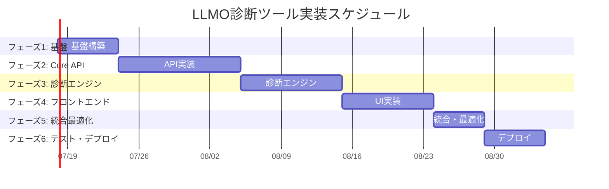

# LLMO診断ツール 実装タスク

## 概要

**全タスク数**: 34
**推定作業時間**: 280時間 (約7週間)
**クリティカルパス**: TASK-001 → TASK-002 → TASK-101 → TASK-201 → TASK-301

## 重要な技術変更点

**注意**: 設計文書分析の結果、アーキテクチャ設計とSupabase Pro統合仕様に相違があります。実装は以下のSupabase Pro統合アーキテクチャで進めます：

- **フロントエンド**: Next.js + DaiLYUP統合
- **バックエンド**: Supabase Edge Functions (Deno)
- **データベース**: Supabase PostgreSQL
- **リアルタイム**: Supabase Real-time
- **ストレージ**: Supabase Storage

## タスク一覧

### フェーズ1: 基盤構築（推定: 48時間）

#### TASK-001: Supabase Pro プロジェクト初期設定

- [x] **タスク完了**
- **タスクタイプ**: DIRECT
- **要件リンク**: Supabase統合基盤
- **依存タスク**: なし
- **実装詳細**:
  - Supabase Pro プロジェクト作成
  - 環境変数設定（本番・ステージング）
  - Supabase CLI初期化
  - プロジェクト接続確認
- **テスト要件**:
  - [ ] Supabase接続テスト
  - [ ] CLI動作確認
  - [ ] 環境変数読み込み確認
- **完了条件**:
  - [ ] Supabase Proプロジェクトが作成されている
  - [ ] CLIで接続できる
  - [ ] 環境変数が正しく設定されている

#### TASK-002: データベーススキーマ構築

- [x] **タスク完了**
- **タスクタイプ**: DIRECT
- **要件リンク**: データベース設計
- **依存タスク**: TASK-001
- **実装詳細**:
  - database-schema-supabase.sqlの実行
  - 全テーブル・インデックス・トリガーの作成
  - Row Level Security (RLS) ポリシー設定
  - 初期データ投入（ベンチマークデータ等）
- **テスト要件**:
  - [ ] 全テーブル作成確認
  - [ ] 制約・インデックスの検証
  - [ ] RLSポリシー動作確認
  - [ ] サンプルデータ挿入・取得テスト
- **完了条件**:
  - [ ] 全テーブルが正常に作成されている
  - [ ] RLSが適切に設定されている
  - [ ] 初期データが投入されている

#### TASK-003: Supabase Edge Functions基盤設定

- [ ] **タスク完了**
- **タスクタイプ**: DIRECT
- **要件リンク**: API設計基盤
- **依存タスク**: TASK-002
- **実装詳細**:
  - Edge Functions ディレクトリ構造作成
  - 共通ライブラリ(_shared)作成
  - CORS設定
  - 環境変数・シークレット設定
- **テスト要件**:
  - [ ] Edge Functions デプロイテスト
  - [ ] CORS設定動作確認
  - [ ] 共通ライブラリ読み込みテスト
- **完了条件**:
  - [ ] Edge Functions基盤が構築されている
  - [ ] 共通機能が利用可能
  - [ ] シークレット管理が設定されている

#### TASK-004: TypeScript型定義セットアップ

- [ ] **タスク完了**
- **タスクタイプ**: DIRECT
- **要件リンク**: interfaces.ts仕様
- **依存タスク**: TASK-002
- **実装詳細**:
  - Supabase型定義生成（supabase gen types）
  - interfaces.tsからプロジェクト全体の型定義作成
  - フロントエンド・バックエンド共通型ライブラリ
- **テスト要件**:
  - [ ] 型定義の生成確認
  - [ ] TypeScriptコンパイルエラーなし
  - [ ] 型安全性の確認
- **完了条件**:
  - [ ] 全システムの型定義が完成している
  - [ ]型安全性が保証されている

### フェーズ2: Core API実装（推定: 96時間）

#### TASK-101: 診断開始API実装

- [ ] **タスク完了**
- **タスクタイプ**: TDD
- **要件リンク**: POST /diagnose
- **依存タスク**: TASK-003, TASK-004
- **実装詳細**:
  - Edge Function: diagnose/index.ts
  - URL正規化・バリデーション
  - キャッシュチェック機能
  - 診断レコード作成
  - URLベースレート制限
- **テスト要件**:
  - [ ] 単体テスト: URL検証ロジック
  - [ ] 単体テスト: レート制限
  - [ ] 統合テスト: データベース連携
  - [ ] E2Eテスト: API呼び出し
- **エラーハンドリング**:
  - [ ] 無効なURL形式
  - [ ] レート制限超過
  - [ ] データベース接続エラー
- **完了条件**:
  - [ ] API仕様通りに動作している
  - [ ] 全テストが通過
  - [ ] エラーハンドリングが適切

#### TASK-102: 診断結果取得API実装

- [ ] **タスク完了**
- **タスクタイプ**: TDD
- **要件リンク**: GET /diagnose/:id
- **依存タスク**: TASK-101
- **実装詳細**:
  - 診断結果の複合取得（全レイヤー＋改善提案）
  - ベンチマーク比較データ生成
  - レスポンス形式の統一
- **テスト要件**:
  - [ ] 単体テスト: 結果集計ロジック
  - [ ] 統合テスト: 複合クエリ
  - [ ] パフォーマンステスト: 大量データ
- **完了条件**:
  - [ ] 診断結果が正しく返却される
  - [ ] パフォーマンス要件を満たす
  - [ ] ベンチマーク比較が正常動作

#### TASK-103: PDF生成API実装

- [ ] **タスク完了**
- **タスクタイプ**: TDD
- **要件リンク**: POST /pdf-request
- **依存タスク**: TASK-102
- **実装詳細**:
  - PDF生成機能（HTML→PDF変換）
  - Supabase Storage連携
  - 署名付きURLの生成
  - メール送信機能（任意）
- **テスト要件**:
  - [ ] 単体テスト: PDF生成
  - [ ] 統合テスト: Storage連携
  - [ ] E2Eテスト: ダウンロードフロー
- **エラーハンドリング**:
  - [ ] PDF生成失敗
  - [ ] Storage容量不足
  - [ ] メール送信エラー
- **完了条件**:
  - [ ] PDFが正しく生成される
  - [ ] Storage連携が動作
  - [ ] 7日後の自動削除設定

#### TASK-104: バックグラウンド診断処理実装

- [ ] **タスク完了**
- **タスクタイプ**: TDD
- **要件リンク**: process-diagnostic Edge Function
- **依存タスク**: TASK-101
- **実装詳細**:
  - Layer 1～3の並列処理オーケストレーション
  - 外部API統合（Google Knowledge Graph等）
  - スコア計算・加重処理
  - 改善提案生成アルゴリズム
- **テスト要件**:
  - [ ] 単体テスト: 各レイヤー処理
  - [ ] 単体テスト: スコア計算
  - [ ] 統合テスト: 外部API連携
  - [ ] E2Eテスト: 完全な診断フロー
- **エラーハンドリング**:
  - [ ] 外部API呼び出しエラー
  - [ ] タイムアウト処理
  - [ ] 部分的な結果の処理
- **完了条件**:
  - [ ] 診断処理が完全に動作
  - [ ] 外部API連携が安定
  - [ ] エラー復旧機能が動作

#### TASK-105: リアルタイム進捗API実装

- [ ] **タスク完了**
- **タスクタイプ**: TDD
- **要件リンク**: GET /diagnose/:id/progress
- **依存タスク**: TASK-104
- **実装詳細**:
  - Supabase Realtime連携
  - 診断進捗のリアルタイム更新
  - WebSocket接続管理
- **テスト要件**:
  - [ ] 単体テスト: 進捗更新ロジック
  - [ ] 統合テスト: Realtime連携
  - [ ] E2Eテスト: リアルタイム通信
- **完了条件**:
  - [ ] リアルタイム進捗が正常動作
  - [ ] 接続管理が適切
  - [ ] パフォーマンスが良好

### フェーズ3: 診断エンジン実装（推定: 80時間）

#### TASK-201: Layer 1（信頼性）評価実装

- [ ] **タスク完了**
- **タスクタイプ**: TDD
- **要件リンク**: Layer1 E-E-A-T評価
- **依存タスク**: TASK-104
- **実装詳細**:
  - E-E-A-T分析アルゴリズム
  - エンティティ検証（Google Knowledge Graph連携）
  - コンテンツ品質評価
  - 被リンク分析（Ahrefs API連携）
- **テスト要件**:
  - [ ] 単体テスト: E-E-A-T計算
  - [ ] 単体テスト: エンティティ検証
  - [ ] 統合テスト: 外部API連携
  - [ ] パフォーマンステスト: 処理時間
- **エラーハンドリング**:
  - [ ] Knowledge Graph API制限
  - [ ] 被リンク分析API エラー
  - [ ] コンテンツ取得失敗
- **完了条件**:
  - [ ] Layer1スコアが正確に算出される
  - [ ] 外部API連携が安定
  - [ ] パフォーマンス要件を満たす

#### TASK-202: Layer 2（構造）評価実装

- [ ] **タスク完了**
- **タスクタイプ**: TDD
- **要件リンク**: Layer2 構造評価
- **依存タスク**: TASK-201
- **実装詳細**:
  - DOM解析（Puppeteer for Deno）
  - AIフレンドリー形式チェック
  - セマンティックHTML評価
  - 読みやすさスコア計算
- **テスト要件**:
  - [ ] 単体テスト: DOM解析ロジック
  - [ ] 単体テスト: セマンティック評価
  - [ ] 統合テスト: Puppeteer連携
  - [ ] E2Eテスト: 各種サイト対応
- **エラーハンドリング**:
  - [ ] JavaScript実行エラー
  - [ ] DOM構造の複雑さ
  - [ ] メモリ不足
- **完了条件**:
  - [ ] Layer2スコアが正確に算出される
  - [ ] 多様なサイト構造に対応
  - [ ] メモリ効率が良好

#### TASK-203: Layer 3（技術）評価実装

- [ ] **タスク完了**
- **タスクタイプ**: TDD
- **要件リンク**: Layer3 技術評価
- **依存タスク**: TASK-202
- **実装詳細**:
  - Schema.org構造化データ検証
  - Core Web Vitals測定（PageSpeed Insights）
  - robots.txt・sitemap.xml解析
  - HTTPS・セキュリティ評価
- **テスト要件**:
  - [ ] 単体テスト: Schema.org検証
  - [ ] 単体テスト: Core Web Vitals
  - [ ] 統合テスト: PageSpeed API
  - [ ] セキュリティテスト: HTTPS評価
- **エラーハンドリング**:
  - [ ] PageSpeed API制限
  - [ ] 構造化データエラー
  - [ ] ネットワークタイムアウト
- **完了条件**:
  - [ ] Layer3スコアが正確に算出される
  - [ ] 技術的評価が網羅的
  - [ ] セキュリティ評価が適切

#### TASK-204: 改善提案生成エンジン実装

- [ ] **タスク完了**
- **タスクタイプ**: TDD
- **要件リンク**: ImprovementSuggestion仕様
- **依存タスク**: TASK-203
- **実装詳細**:
  - 未達項目の分析
  - 優先順位決定アルゴリズム
  - 改善提案テンプレートシステム
  - カスタマイズ処理
- **テスト要件**:
  - [ ] 単体テスト: 優先順位決定
  - [ ] 単体テスト: 提案カスタマイズ
  - [ ] 統合テスト: 全レイヤー連携
  - [ ] A/Bテスト: 提案品質
- **完了条件**:
  - [ ] 適切な改善提案が生成される
  - [ ] 優先順位が正確
  - [ ] カスタマイズが効果的

### フェーズ4: フロントエンド実装（推定: 72時間）

#### TASK-301: DaiLYUP サイト統合基盤

- [ ] **タスク完了**
- **タスクタイプ**: DIRECT
- **要件リンク**: DaiLYUP統合仕様
- **依存タスク**: TASK-002
- **実装詳細**:
  - Next.js + DaiLYUPデザインシステム統合
  - 基本レイアウト・ナビゲーション
  - SEOメタデータ設定
  - 多言語対応基盤
- **テスト要件**:
  - [ ] ビルドテスト
  - [ ] レスポンシブデザイン確認
  - [ ] アクセシビリティテスト
- **UI/UX要件**:
  - [ ] DaiLYUPデザイン準拠
  - [ ] モバイル対応
  - [ ] アクセシビリティ（WCAG 2.1 AA）
- **完了条件**:
  - [ ] DaiLYUPサイトに統合されている
  - [ ] デザインが一貫している
  - [ ] SEO設定が完了

#### TASK-302: LLMO診断トップページ実装

- [ ] **タスク完了**
- **タスクタイプ**: TDD
- **要件リンク**: /llmo-diagnostic ページ
- **依存タスク**: TASK-301, TASK-101
- **実装詳細**:
  - ヒーローセクション（URL入力フォーム）
  - 特徴紹介セクション
  - ベンチマーク情報表示
  - CTAセクション
- **テスト要件**:
  - [ ] コンポーネントテスト
  - [ ] フォームバリデーションテスト
  - [ ] E2Eテスト: 診断開始フロー
- **UI/UX要件**:
  - [ ] ローディング状態: 診断開始時のスピナー
  - [ ] エラー表示: 無効URL時のトースト
  - [ ] モバイル対応: タッチフレンドリー
  - [ ] アクセシビリティ: フォームラベル、キーボード操作
- **完了条件**:
  - [ ] 診断を開始できる
  - [ ] UI/UX要件を満たす
  - [ ] エラーハンドリングが適切

#### TASK-303: 診断進行中ページ実装

- [ ] **タスク完了**
- **タスクタイプ**: TDD
- **要件リンク**: /llmo-diagnostic/processing/[id] ページ
- **依存タスク**: TASK-302, TASK-105
- **実装詳細**:
  - リアルタイム進捗表示
  - 処理段階の可視化
  - 推定時間表示
  - キャンセル機能
- **テスト要件**:
  - [ ] リアルタイム通信テスト
  - [ ] 進捗表示テスト
  - [ ] 接続断時の処理テスト
- **UI/UX要件**:
  - [ ] ローディング状態: プログレスバー + 段階表示
  - [ ] エラー表示: 接続エラー時の再接続オプション
  - [ ] モバイル対応: 縦画面対応
  - [ ] アクセシビリティ: 進捗の音声読み上げ対応
- **完了条件**:
  - [ ] リアルタイム進捗が表示される
  - [ ] ユーザー体験が良好
  - [ ] エラー処理が適切

#### TASK-304: 診断結果レポートページ実装

- [ ] **タスク完了**
- **タスクタイプ**: TDD
- **要件リンク**: /llmo-diagnostic/report/[id] ページ
- **依存タスク**: TASK-303, TASK-102
- **実装詳細**:
  - スコア表示（ゲージチャート）
  - ベンチマーク比較視覚化
  - 改善提案リスト（優先度別）
  - 詳細結果の展開表示
- **テスト要件**:
  - [ ] チャート表示テスト
  - [ ] データビジュアライゼーションテスト
  - [ ] レスポンシブテスト
- **UI/UX要件**:
  - [ ] ローディング状態: スケルトン画面
  - [ ] エラー表示: データ取得失敗時
  - [ ] モバイル対応: スワイプ・タップ操作
  - [ ] アクセシビリティ: チャートの代替テキスト
- **完了条件**:
  - [ ] 診断結果が見やすく表示される
  - [ ] インタラクティブな操作が可能
  - [ ] 多様なデバイスで利用可能

#### TASK-305: PDFレポート要求機能実装

- [ ] **タスク完了**
- **タスクタイプ**: TDD
- **要件リンク**: PDFRequest機能
- **依存タスク**: TASK-304, TASK-103
- **実装詳細**:
  - PDF生成要求フォーム
  - 個人情報入力（任意）
  - マーケティング同意管理
  - ダウンロード処理
- **テスト要件**:
  - [ ] フォームバリデーションテスト
  - [ ] PDF生成・ダウンロードテスト
  - [ ] プライバシー設定テスト
- **UI/UX要件**:
  - [ ] ローディング状態: PDF生成中のプログレス
  - [ ] エラー表示: 生成失敗時の詳細メッセージ
  - [ ] モバイル対応: ダウンロード処理
  - [ ] アクセシビリティ: フォームラベル完備
- **完了条件**:
  - [ ] PDFが正常に生成・ダウンロードされる
  - [ ] プライバシー設定が適切
  - [ ] ユーザビリティが高い

### フェーズ5: 統合・最適化（推定: 40時間）

#### TASK-401: Supabase Real-time統合

- [ ] **タスク完了**
- **タスクタイプ**: TDD
- **要件リンク**: Realtime設定
- **依存タスク**: TASK-105, TASK-303
- **実装詳細**:
  - Supabase Realtime設定
  - フロントエンドWebSocket接続
  - 診断進捗のリアルタイム同期
  - 接続断時の再接続処理
- **テスト要件**:
  - [ ] Realtime接続テスト
  - [ ] データ同期テスト
  - [ ] 接続障害時テスト
- **完了条件**:
  - [ ] リアルタイム機能が安定動作
  - [ ] パフォーマンスが良好
  - [ ] エラー処理が適切

#### TASK-402: パフォーマンス最適化

- [ ] **タスク完了**
- **タスクタイプ**: TDD
- **要件リンク**: パフォーマンス要件
- **依存タスク**: TASK-305, TASK-401
- **実装詳細**:
  - Edge Functionsのコールドスタート最適化
  - データベースクエリ最適化
  - キャッシュ戦略の調整
  - 画像・アセット最適化
- **テスト要件**:
  - [ ] 負荷テスト
  - [ ] レスポンス時間測定
  - [ ] メモリ使用量測定
- **完了条件**:
  - [ ] パフォーマンス要件を満たす
  - [ ] スケーラビリティが確保される
  - [ ] リソース効率が良好

#### TASK-403: セキュリティ強化

- [ ] **タスク完了**
- **タスクタイプ**: TDD
- **要件リンク**: セキュリティ要件
- **依存タスク**: TASK-402
- **実装詳細**:
  - 入力値検証の強化
  - SQL Injection対策
  - XSS対策
  - CSRF対策
  - レート制限の調整
- **テスト要件**:
  - [ ] セキュリティペネトレーションテスト
  - [ ] 脆弱性スキャン
  - [ ] レート制限テスト
- **完了条件**:
  - [ ] セキュリティ要件を満たす
  - [ ] 脆弱性が存在しない
  - [ ] レート制限が適切

### フェーズ6: テスト・デプロイ（推定: 44時間）

#### TASK-501: E2Eテストスイート実装

- [ ] **タスク完了**
- **タスクタイプ**: TDD
- **要件リンク**: 全要件
- **依存タスク**: TASK-403
- **実装詳細**:
  - Playwright E2Eテストセットアップ
  - 主要ユーザーフローのテスト
  - 異なるブラウザ・デバイステスト
  - パフォーマンステスト
- **テスト要件**:
  - [ ] 全機能のE2Eテスト
  - [ ] クロスブラウザテスト
  - [ ] モバイルデバイステスト
  - [ ] パフォーマンステスト
- **完了条件**:
  - [ ] すべてのE2Eテストが通過
  - [ ] 複数環境での動作確認
  - [ ] パフォーマンス要件達成

#### TASK-502: CI/CDパイプライン構築

- [ ] **タスク完了**
- **タスクタイプ**: DIRECT
- **要件リンク**: デプロイ要件
- **依存タスク**: TASK-501
- **実装詳細**:
  - GitHub Actionsワークフロー設定
  - 自動テスト実行
  - Supabase Edge Functionsデプロイ
  - フロントエンドデプロイ（Vercel）
- **テスト要件**:
  - [ ] CI/CDパイプラインテスト
  - [ ] 自動デプロイテスト
  - [ ] ロールバックテスト
- **完了条件**:
  - [ ] CI/CDが正常動作
  - [ ] 自動デプロイが可能
  - [ ] ロールバックが可能

#### TASK-503: 本番環境デプロイ

- [ ] **タスク完了**
- **タスクタイプ**: DIRECT
- **要件リンク**: 本番環境要件
- **依存タスク**: TASK-502
- **実装詳細**:
  - 本番Supabaseプロジェクト設定
  - DNS設定（DaiLYUPドメイン統合）
  - SSL証明書設定
  - 監視・アラート設定
- **テスト要件**:
  - [ ] 本番環境動作確認
  - [ ] SSL証明書確認
  - [ ] 監視システム確認
- **完了条件**:
  - [ ] 本番環境が正常動作
  - [ ] SSL/セキュリティ設定完了
  - [ ] 監視体制が整備されている

#### TASK-504: ドキュメント作成

- [ ] **タスク完了**
- **タスクタイプ**: DIRECT
- **要件リンク**: 保守性要件
- **依存タスク**: TASK-503
- **実装詳細**:
  - API仕様書の最終化
  - 運用マニュアル作成
  - トラブルシューティングガイド
  - ユーザー向けヘルプドキュメント
- **完了条件**:
  - [ ] すべてのドキュメントが完成
  - [ ] 運用に必要な情報が網羅されている
  - [ ] ユーザーサポート体制が整っている

## 実行順序

## マイルストーン

- **M1: 基盤完成** (TASK-004完了時)
  - Supabaseプロジェクト稼働
  - データベーススキーマ完成
  - 型定義システム構築完了

- **M2: API完成** (TASK-105完了時)
  - 全診断APIが動作
  - リアルタイム進捗機能完成
  - 外部API統合完了

- **M3: 診断エンジン完成** (TASK-204完了時)
  - 3層診断アルゴリズム完成
  - 改善提案生成機能完成
  - 精度・パフォーマンス要件達成

- **M4: UI完成** (TASK-305完了時)
  - DaiLYUP統合UI完成
  - 全ユーザーフロー実装完了
  - レスポンシブ・アクセシビリティ対応完了

- **M5: 本番準備完了** (TASK-403完了時)
  - パフォーマンス・セキュリティ要件達成
  - 統合テスト完了
  - 本番デプロイ準備完了

- **M6: リリース** (TASK-504完了時)
  - 本番環境リリース完了
  - 運用体制構築完了
  - ドキュメント完備

## 並列実行可能なタスクグループ

### グループA: 基盤（並行実行不可・順次実行）
- TASK-001 → TASK-002 → TASK-003 → TASK-004

### グループB: API実装（一部並行実行可能）
- TASK-101（必須） → TASK-102, TASK-103（並行）
- TASK-104 → TASK-105

### グループC: 診断エンジン（並行実行可能）
- TASK-201, TASK-202, TASK-203（並行）
- → TASK-204

### グループD: フロントエンド（一部並行実行可能）
- TASK-301（必須） → TASK-302 → TASK-303, TASK-304（並行）
- → TASK-305

### グループE: 統合・最適化（順次実行）
- TASK-401 → TASK-402 → TASK-403

### グループF: テスト・デプロイ（順次実行）
- TASK-501 → TASK-502 → TASK-503 → TASK-504

## 品質保証

### 各フェーズの品質ゲート
1. **基盤フェーズ**: 全テーブル・制約の作成確認
2. **API フェーズ**: 全エンドポイントの正常動作確認
3. **診断エンジンフェーズ**: 診断精度・パフォーマンス要件達成
4. **フロントエンドフェーズ**: UI/UX要件・アクセシビリティ要件達成
5. **統合フェーズ**: セキュリティ・パフォーマンス要件達成
6. **デプロイフェーズ**: 本番環境での安定動作確認

### レビューポイント
- [ ] コードレビュー（すべてのPR）
- [ ] セキュリティレビュー（M5時点）
- [ ] パフォーマンステスト（M3, M5時点）
- [ ] UI/UXレビュー（M4時点）
- [ ] 統合テスト（M5時点）

---

**注意事項**:
- 実装前に最新の設計文書を再確認してください
- 各タスクのTDD/DIRECTプロセスに従って実装を進めてください
- 定期的に進捗を更新し、ブロッカーは早期に報告してください
- セキュリティ・プライバシー要件は最優先で対応してください